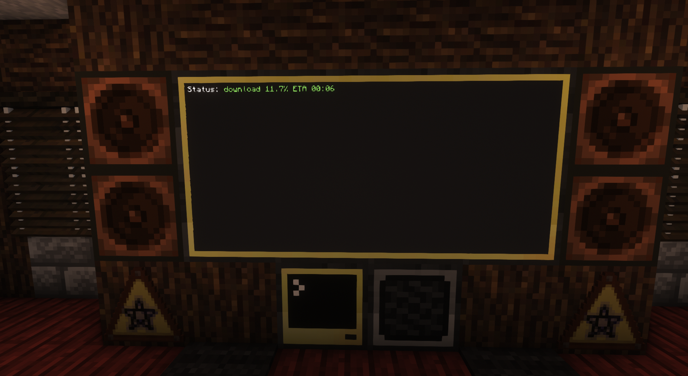

# [YouCube](https://youcube.madefor.cc/) TV for [CC:Tweaked](https://tweaked.cc/t)

This is a television in Minecraft based on the [YouCube](https://github.com/CC-Youcube/) project. It is very similar to the reference client built into YouCube however instead of acting as a CLI and displaying in the current terminal, it displays to an external display and uses a Wireless Pocket Computer as a remote in order to play content.

## Features
- Playback of videos and playlists from Youtube
- Playback of videos from some other [supported sites](https://github.com/yt-dlp/yt-dlp/blob/master/supportedsites.md)
- Remote control playback
- UI TV Remote

## Setup
In order to set this up ensure you have access to
- 1x Advanced Computer
- 1x Wireless/Ender Modem
- 1x Wireless/Ender Pocket Computer
- Some Advanced Monitors
  - Note that this is only tested up to a 4x2 size

### Television Setup
1. Copy all files from television directory to the computer
  - Optionally, change the variable `server` in startup.lua to point to a different [YouCube server](https://github.com/CC-YouCube/server)
2. Attach a monitor and wireless modem
3. Restart the computer
### Remote Setup
1. Copy all files from remote directory to the pocket computer
2. Restart the pocket computer
3. Select a theme
4. Queue a track using the top search box

## Screenshots
### Main UI

### TV Screen (downloading)

### TV Screen (playing)

### Themes
- [Dracula](documentation/themes/dracula.png)
- [Matte Blue](documentation/themes/matte_vlue.png)
- [Hot Pink](documentation/themes/hot_pink.png)
- [Vaporwave](documentation/themes/vaporwave.png)
- [Kiwi](documentation/themes/kiwi.png)

## TODO
- Create install scripts for both sides
---
This project is licensed under the [GPL3.0 License](LICENSE)
